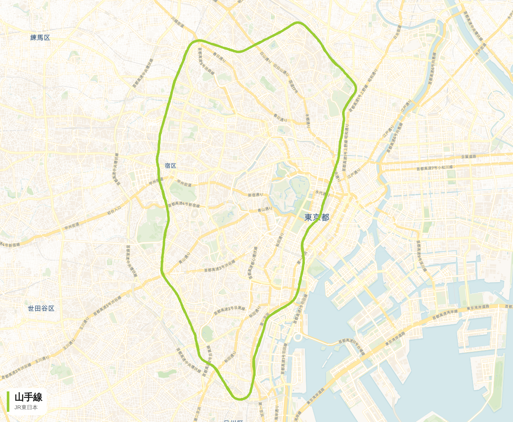

# 路線図メーカー (rail-route-map)

日本の鉄道路線を選んで地図上に経路を描画し、その地図を **PNG 画像** として保存できる Web アプリです。



## 特徴

- 主要な鉄道路線（JR・地下鉄・大手私鉄・新幹線など）をエリア / 検索で選択
- 一覧にない路線も OpenStreetMap の路線名で自由に検索して表示
- 線の太さ・背景地図（カラー / 淡色 / ダーク）・駅表示を切り替え
- 表示中の地図（路線・駅・路線名キャプション入り）をワンクリックで画像保存

## 仕組み

- 地図描画: [Leaflet](https://leafletjs.com/) + [CARTO](https://carto.com/) ベースマップ（OpenStreetMap）
- 路線ジオメトリ: [Overpass API](https://overpass-api.de/)（OpenStreetMap の `type=route` リレーション）
  - バックエンドが Overpass へ問い合わせて結果を `data/cache/` に 30 日キャッシュします
- 画像生成: [leaflet-image](https://github.com/mapbox/leaflet-image) でタイルを描画し、経路をキャンバスに重ね描き

## 起動

```bash
npm install
npm start
# http://localhost:3000
```

環境変数 `PORT` でポートを変更できます。

## API

| エンドポイント | 説明 |
| --- | --- |
| `GET /api/lines` | 収録路線の一覧 (JSON) |
| `GET /api/route?id=<lineId>` | 収録路線の経路を GeoJSON で取得 |
| `GET /api/route?name=<名前>&operator=<事業者>` | 任意の路線名で経路を取得 |
| `GET /api/search?q=<語>` | 路線一覧を絞り込み |

## 路線の追加

`data/lines.json` に 1 件追加するだけです。

```json
{
  "id": "tobu-tojo",
  "name": "東武東上線",
  "operator": "東武鉄道",
  "region": "関東",
  "color": "#0067c0",
  "nameRegex": "東上線",
  "operatorRegex": "東武鉄道"
}
```

`nameRegex` / `operatorRegex` は Overpass の `name` / `operator` タグに対する正規表現です。
該当するリレーションのジオメトリをすべて結合して描画します。

## データ出典

- 地図 / 路線データ: © OpenStreetMap contributors（[ODbL](https://www.openstreetmap.org/copyright)）
- ベースマップタイル: © CARTO
